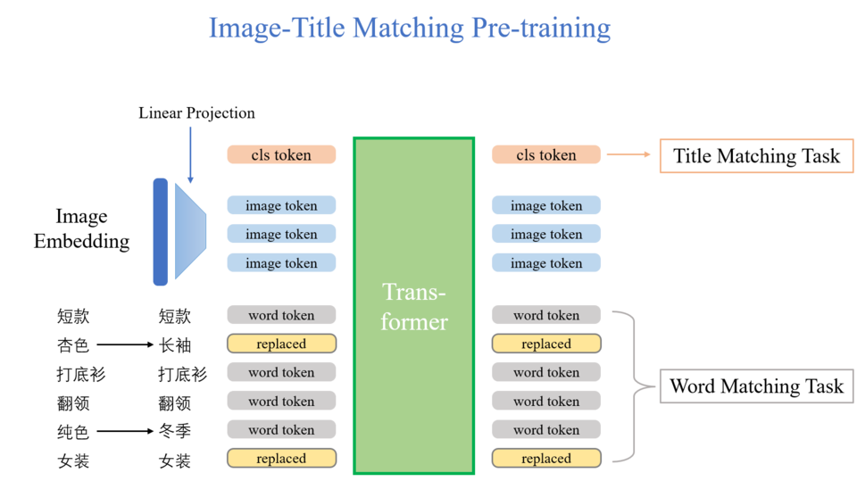
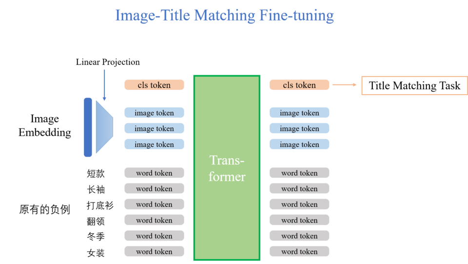
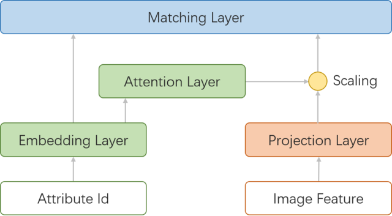

# GAIIC2022 赛道一 Rank 1

[https://gaiic.caai.cn/ai2022](https://gaiic.caai.cn/ai2022/#/)

## 赛题背景

京东积累了电商零售场景下的海量商品的图文数据，其中商品主图和商品标题是最直观、最容易触达到用户的数据。因此，图文的一致性（即图文匹配）至关重要，要求模型根据图片和文本判断出两种模态数据传递的信息是否一致。通常，商品主图和标题包含大量的商品属性信息。在实际业务中，图片里商品的关键属性与商品标题描述的是否匹配，是影响用户体验的重要因素。本赛题要求参赛队伍利用脱敏后的京东电商平台图文数据，通过商品图片与商品标题在整体以及商品关键属性上的关联程度来判断两者是否匹配。

## 赛题数据

本赛题使用的是京东电商平台脱敏后的图文数据，主要来源于服饰、鞋靴等领域。对于商品图片，采用图像识别模型统一生成为2048维的图像feature。

### 训练数据

训练集由15万条有标注数据构成（包括验证集，由选手自己切分），其中5万有关键属性标注，其余10万无关键属性标注。有关键属性标注数据（均为图文匹配数据），提供商品图片feature、商品标题信息、商品部分关键属性值（非全部）、以及商品图片与商品标题整体是否匹配（图文），商品图片与关键属性是否匹配的标注（如领型、袖长等）；无关键属性标注数据，提供商品图片feature、商品标题、以及图文是否匹配的标注。关于关键属性，将提供属性与属性词表。

## 环境配置

镜像名称：就不提交，就是玩儿~复现镜像

```python
# Env  
python==3.8.5  
CUDA==11.3  

# Package  
pytorch==1.11.0  
ltp==4.1.5.post2  
tqdm==4.62.3  
einops==0.4.1  
torch==1.11.0  
scikit-learn==0.23.2  
numpy==1.21.5
```

## 训练和测试

查看`train.ipynb`和`test.ipynb`

## 预训练模型

使用了[哈工大语言技术平台（Language Technology Plantform）](https://github.com/HIT-SCIR/ltp)的Base1(v3)分词模型，LTP平台面向国内外大学、中科院各研究所以及个人研究者免费开放源代码。我们使用此模型对文本进行分词处理。

## 算法

## 整体思路介绍

实验证明，将图文匹配和属性匹配当作两个单独的二分类任务能够取得更好的分类效果。对于属性匹配任务，需要判断每个关键属性与图片特征是否匹配。对于图文匹配任务，不同于中文Bert预训练大多以字为单位进行编码和处理，电商文本由大量没有顺序信息的词组成，我们针对此特点对其进行了分词处理并以词为单位设计了两种全新的预训练任务，从头进行预训练取得了非常好的效果

### 图文匹配

官方数据集包含了大量的正例和少量的负例。负例数量不足是限制图文匹配效果的主要关键点。虽然通过正例人工生成负例能够一定程度上弥补这一缺陷， 但是我们认为，原始的负例数据包含了最真实的负例分布，是十分宝贵的数据，人工生成的负例与真实分布始终存在一定的偏差，最终实验结果也证实了这一点。于是我们将图文匹配任务分为了两个训练流程。

1. 设计了两种以词为单位的预训练任务，用正例和人工生成的负例进行预训练；
2. 用原有的正负例进行微调。

### 属性匹配

对于属性匹配任务的主要算法思路为：

1. 对属性赋予唯一的id，并使用nn.Embedding对id进行编码处理；
2. 使用软注意力机制生成属性Embedding对于图像特征的注意力，并作用于图像特征上；
3. 将属性Embedding以及通过注意力机制缩放的图像特征拼接后输出神经网络预测该属性与图像是否匹配。

## 方法的创新点

### 图文匹配

1. 训练了以中文词为单位的Transformer预训练模型
2. 设计了两种全新的以词为单位的预训练任务
3. 对图片embedding进行了特征分离，更好的与每个单独的词义相匹配
4. 对于无顺序信息的电商文本，去掉了位置编码，但是对图片embedding过程添加了位置编码。总体来看，这种做法要好于给图片和文本添加不同的token embedding要好。因为其一这种token信息可以通过只为图片embedding添加特殊编码（这里是位置编码）等价实现，其二不同的位置编码能够特化图片embedding分离的每个子特征信息。

具体实现如下图所示（位置编码的添加没有标出）：





图中展示了主要的创新点和完整的训练流程。Image embedding通过线性层投射为多个词级别的子特征。Cls token用来判断图文整体的匹配。每个词语在输入前有概率会被替换（replaced）使正例变为人工负例。

下面将具体介绍设计的两种预训练任务：

1. 图文匹配任务。图文匹配任务即判断图片和文本是否一致匹配没有错误。正例文本通过部分替换词语动态生成人工负例，此任务为判断整体的二分类任务，区分正例和人工生成的负例。
2. 词语匹配任务。词语匹配任务为词级别的二分类任务，我们对transformer最后一层每个词的embedding都做一次二分类判断该词是否被替换。这个任务比起图文匹配任务要更难更具体，可以提升预训练模型对每个词的理解程度。
3. 负例生成方式。预训练过程的负例生成方式也十分重要。首先设定每个正例有50%的概率进行负例生成，我们通过替换词语的方式进行负例生成（等概率可能替换一个或两个词）；如果这个词为关键属性，则进行同类型不同义关键属性的替换，如果这个词非关键属性，则依据词频随机进行替换。由于替换过程可能会出现替换到该文本本身存在的词语或意义相等的关键属性，则显然这个替换后的结果依旧为正例，这样会使得正例比例上升。为了平衡正负例比例，我们调整为60%概率进行负例生成流程。

### 属性匹配

1. 通过设置属性embedding的方式（为每个关键属性设置一个可学习的embedding来代表这个属性），大大简化了属性的表示，简化了属性匹配任务的训练输入；
2. 并且通过软注意力机制对图像特征进行放缩来突出特定属性更需要注意到的特征点使得图像特征能被更充分的使用；
3. 通过相等语义属性替换的方式进行正例增强以及相似属性（同类型不同义）替换的方式进行负例构造，使模型能够更好的辨识属性与图像的关系；
4. 通过图文匹配则属性全匹配的关系来使图文预测结果指导属性预测结果，进一步提升了模型的预测能力。

## 网络结构

### 图文匹配

提取了huggingface的transformer结构，搭建了6层的transformer，分类头采用简单的单线性层。图片特征转换为多个子特征是通过一个线性层映射的。具体结构可见方法的创新点小节图文匹配的图。

### 属性匹配



## 损失函数

两个任务均使用BCEWithLogitsLoss作为二分类损失函数。

## 数据扩增

### 图文匹配

预训练过程的负例生成方式。首先设定每个正例有50%的概率进行负例生成，我们通过替换词语的方式进行负例生成（等概率可能替换一个或两个词）；如果这个词为关键属性，则进行同类型不同义关键属性的替换，如果这个词非关键属性，则依据词频随机进行替换。由于替换过程可能会出现替换到该文本本身存在的词语或意义相等的关键属性，则显然这个替换后的结果依旧为正例，这样会使得正例比例上升。为了平衡正负例比例，我们调整为60%概率进行负例生成流程。

### 属性匹配

由于只有带有属性匹配标签的数据，而不存在属性不匹配标签的数据，所以需要通过数据扩增的方式产生属性与图片不匹配负例才能合理的进行线下的训练以及验证。我们首先构造了一个属性值关系字典，该字典中对于每个属性值都记录了两个字段：

1. equal_attr记录与该属性含义相等的属性值；
2. similar_attr记录与该属性同属于一个类型下的不相等的属性值。

对于每个图片中的每个属性，都有47%的概率保持为正例，其余53%产生负例（使用关系字典中的similar_attr进行均匀采样），其中正例中的10%的属性会进行正例增强（使用关系字典中的equal_attr进行均匀采样）。

## 模型集成

### 图文匹配

由于我们的模型较小，可以采用4折模型集成。这里的4折不同于通常意义的4折，数据通过几次不同的随机打乱后再划分训练和验证集。最后将每个模型预测的匹配概率相加取平均来作为最终的匹配置信度，当置信度大于0.5时则认为属性与图文匹配。

### 属性匹配

由于模型较小，所以使用10折交叉验证进行模型集成，使用到的coarse数据中图文匹配的89588条数据以及fine的50000条数据，随机将这些数据划分为10份依次取其中的9份进行训练以及1份进行验证。最后将每个模型预测的匹配概率相加取平均来作为最终的匹配置信度，当置信度大于0.5时则认为属性与图文匹配。

## 算法的其他细节

1. 预处理阶段对于几个重复但不同义的关键属性进行了重定义。比如鞋的“系带”替换为“系带鞋”，裤的“系带”替换为“系带裤”。
2. 分词预处理阶段我们整合了大量出现次数少，表达方式多但意思相近的颜色词，去掉了几个没有明确含义的单字词，删除了出现次数少于50的词，最终词表约为450个。
3. 图文匹配预训练过程在transformer输入前加了0.3的dropout。属性匹配对图像特征也添加了0.3的dropout。
4. 图文匹配微调过程在一个epoch中使每个负例出现两次从而提高负例的利用效率。
5. 由于图文匹配使用了词级别的embedding表示，需要自己实现词级别的tokenizer以及DataLoader中词级别的collate_fn核对函数。
6. 由于这次任务存在图文匹配则属性全匹配的推论，并且官方直接提供了图文负例数据（属性没有）而非我们随机生成的负例，所以图文匹配的训练结果更加符合真实分布，所以我们可以使用图文的预测结果来指导属性的预测结果，这里我们使用了图文匹配则属性全设置为匹配的指导方法使得属性的预测结果。
